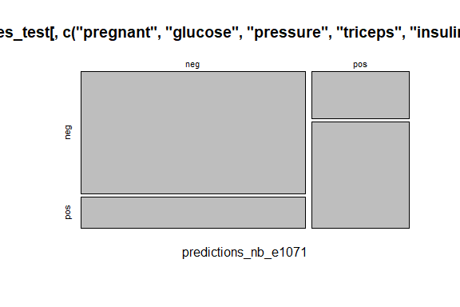

Business Intelligence Lab-5 Submission Markdown
================
<Champions>
\<22/09/2023\>

- [Student Details](#student-details)
- [STEP 1. Install and Load the Required
  Packages](#step-1-install-and-load-the-required-packages)
- [STEP 2. Loading Pima Indians Diabetes
  dataset](#step-2-loading-pima-indians-diabetes-dataset)
  - [1. Split the dataset](#1-split-the-dataset)
  - [2. Train a Naive Bayes classifier using the training
    dataset](#2-train-a-naive-bayes-classifier-using-the-training-dataset)
    - [2.a. OPTION 1: naiveBayes() function in the e1071
      package](#2a-option-1-naivebayes-function-in-the-e1071-package)
    - [2.b. OPTION 2: naiveBayes() function in the caret
      package](#2b-option-2-naivebayes-function-in-the-caret-package)
  - [3. Test the trained model using the testing
    dataset](#3-test-the-trained-model-using-the-testing-dataset)
    - [3.a. Test the trained e1071 Naive Bayes model using the testing
      dataset](#3a-test-the-trained-e1071-naive-bayes-model-using-the-testing-dataset)
    - [3.b. Test the trained caret Naive Bayes model using the testing
      dataset](#3b-test-the-trained-caret-naive-bayes-model-using-the-testing-dataset)
  - [4. View the Results](#4-view-the-results)
    - [4.a. e1071 Naive Bayes model and test results using a confusion
      matrix](#4a-e1071-naive-bayes-model-and-test-results-using-a-confusion-matrix)
    - [4.b. caret Naive Bayes model and test results using a confusion
      matrix](#4b-caret-naive-bayes-model-and-test-results-using-a-confusion-matrix)
- [STEP 3. Bootstrapping](#step-3-bootstrapping)
  - [1. Train a linear regression model (for
    regression)](#1-train-a-linear-regression-model-for-regression)
    - [1.a. Bootstrapping train
      control](#1a-bootstrapping-train-control)
  - [2. Test the trained linear regression model using the testing
    dataset](#2-test-the-trained-linear-regression-model-using-the-testing-dataset)
  - [3. View the RMSE and the predicted values for the 12
    observations](#3-view-the-rmse-and-the-predicted-values-for-the-12-observations)
  - [4. Use the model to make a prediction on unseen new
    data](#4-use-the-model-to-make-a-prediction-on-unseen-new-data)
- [STEP 4. CV, Repeated CV, and LOOCV](#step-4-cv-repeated-cv-and-loocv)
  - [1. Regression: Linear Model](#1-regression-linear-model)
    - [1.a. 10-fold cross validation](#1a-10-fold-cross-validation)
    - [1.b. Test the trained linear model using the testing
      dataset](#1b-test-the-trained-linear-model-using-the-testing-dataset)
    - [1.c. View the RMSE and the predicted
      values](#1c-view-the-rmse-and-the-predicted-values)
  - [2. Classification: LDA with k-fold Cross
    Validation](#2-classification-lda-with-k-fold-cross-validation)
    - [2.a. LDA classifier based on a 5-fold cross
      validation](#2a-lda-classifier-based-on-a-5-fold-cross-validation)
    - [2.b. Test the trained LDA model using the testing
      dataset](#2b-test-the-trained-lda-model-using-the-testing-dataset)
    - [2.c. View the summary of the model and view the confusion
      matrix](#2c-view-the-summary-of-the-model-and-view-the-confusion-matrix)
  - [3. Classification: Naive Bayes with Repeated k-fold Cross
    Validation](#3-classification-naive-bayes-with-repeated-k-fold-cross-validation)
    - [3.a. Train an e1071::naive Bayes classifier based on the churn
      variable](#3a-train-an-e1071naive-bayes-classifier-based-on-the-churn-variable)
    - [3.b. Test the trained naive Bayes classifier using the testing
      dataset](#3b-test-the-trained-naive-bayes-classifier-using-the-testing-dataset)
    - [3.c. View a summary of the naive Bayes model and the confusion
      matrix](#3c-view-a-summary-of-the-naive-bayes-model-and-the-confusion-matrix)
  - [4. Classification: SVM with Repeated k-fold Cross
    Validation](#4-classification-svm-with-repeated-k-fold-cross-validation)
    - [4.a. SVM Classifier using 5-fold cross validation with 3
      reps](#4a-svm-classifier-using-5-fold-cross-validation-with-3-reps)
    - [4.b. Test the trained SVM model using the testing
      dataset](#4b-test-the-trained-svm-model-using-the-testing-dataset)
    - [4.c. View a summary of the model and view the confusion
      matrix](#4c-view-a-summary-of-the-model-and-view-the-confusion-matrix)
  - [5. Classification: Naive Bayes with Leave One Out Cross
    Validation](#5-classification-naive-bayes-with-leave-one-out-cross-validation)
    - [5.a. Train a Naive Bayes classifier based on an
      LOOCV](#5a-train-a-naive-bayes-classifier-based-on-an-loocv)
    - [5.b. Test the trained model using the testing
      dataset](#5b-test-the-trained-model-using-the-testing-dataset)
    - [5.c. View the confusion matrix](#5c-view-the-confusion-matrix)

# Student Details

<table>
<colgroup>
<col style="width: 53%" />
<col style="width: 46%" />
</colgroup>
<tbody>
<tr class="odd">
<td><strong>Student ID Numbers and Names of Group Members</strong></td>
<td><ol type="1">
<li><p>133996 - B - Trevor Ngugi</p></li>
<li><p>134111 - B - Immaculate Haayo</p></li>
<li><p>135859 - B - Pauline Wang’ombe</p></li>
<li><p>127707 - B - Clarice Gitonga</p></li>
<li><p>126761 - B - Virginia Wanjiru</p></li>
</ol></td>
</tr>
<tr class="even">
<td><strong>GitHub Classroom Group Name</strong></td>
<td>Champions</td>
</tr>
<tr class="odd">
<td><strong>Course Code</strong></td>
<td>BBT4206</td>
</tr>
<tr class="even">
<td><strong>Course Name</strong></td>
<td>Business Intelligence II</td>
</tr>
<tr class="odd">
<td><strong>Program</strong></td>
<td>Bachelor of Business Information Technology</td>
</tr>
<tr class="even">
<td><strong>Semester Duration</strong></td>
<td>21<sup>st</sup> August 2023 to 28<sup>th</sup> November 2023</td>
</tr>
</tbody>
</table>

# STEP 1. Install and Load the Required Packages

``` r
## caret ----
if (require("caret")) {
  require("caret")
} else {
  install.packages("caret", dependencies = TRUE,
                   repos = "https://cloud.r-project.org")
}
```

    ## Loading required package: caret

    ## Loading required package: ggplot2

    ## Loading required package: lattice

``` r
## klaR ----
if (require("klaR")) {
  require("klaR")
} else {
  install.packages("klaR", dependencies = TRUE,
                   repos = "https://cloud.r-project.org")
}
```

    ## Loading required package: klaR

    ## Loading required package: MASS

``` r
## e1071 ----
if (require("e1071")) {
  require("e1071")
} else {
  install.packages("e1071", dependencies = TRUE,
                   repos = "https://cloud.r-project.org")
}
```

    ## Loading required package: e1071

``` r
## readr ----
if (require("readr")) {
  require("readr")
} else {
  install.packages("readr", dependencies = TRUE,
                   repos = "https://cloud.r-project.org")
}
```

    ## Loading required package: readr

``` r
## LiblineaR ----
if (require("LiblineaR")) {
  require("LiblineaR")
} else {
  install.packages("LiblineaR", dependencies = TRUE,
                   repos = "https://cloud.r-project.org")
}
```

    ## Loading required package: LiblineaR

``` r
## naivebayes ----
if (require("naivebayes")) {
  require("naivebayes")
} else {
  install.packages("naivebayes", dependencies = TRUE,
                   repos = "https://cloud.r-project.org")
}
```

    ## Loading required package: naivebayes

    ## naivebayes 0.9.7 loaded

# STEP 2. Loading Pima Indians Diabetes dataset

``` r
if (!is.element("mlbench", installed.packages()[, 1])) {
  
  install.packages("mlbench", dependencies = TRUE)
}
require("mlbench")
```

    ## Loading required package: mlbench

``` r
data("PimaIndiansDiabetes")

## To view dataset
View (PimaIndiansDiabetes)
summary(PimaIndiansDiabetes)
```

    ##     pregnant         glucose         pressure         triceps     
    ##  Min.   : 0.000   Min.   :  0.0   Min.   :  0.00   Min.   : 0.00  
    ##  1st Qu.: 1.000   1st Qu.: 99.0   1st Qu.: 62.00   1st Qu.: 0.00  
    ##  Median : 3.000   Median :117.0   Median : 72.00   Median :23.00  
    ##  Mean   : 3.845   Mean   :120.9   Mean   : 69.11   Mean   :20.54  
    ##  3rd Qu.: 6.000   3rd Qu.:140.2   3rd Qu.: 80.00   3rd Qu.:32.00  
    ##  Max.   :17.000   Max.   :199.0   Max.   :122.00   Max.   :99.00  
    ##     insulin           mass          pedigree           age        diabetes 
    ##  Min.   :  0.0   Min.   : 0.00   Min.   :0.0780   Min.   :21.00   neg:500  
    ##  1st Qu.:  0.0   1st Qu.:27.30   1st Qu.:0.2437   1st Qu.:24.00   pos:268  
    ##  Median : 30.5   Median :32.00   Median :0.3725   Median :29.00            
    ##  Mean   : 79.8   Mean   :31.99   Mean   :0.4719   Mean   :33.24            
    ##  3rd Qu.:127.2   3rd Qu.:36.60   3rd Qu.:0.6262   3rd Qu.:41.00            
    ##  Max.   :846.0   Max.   :67.10   Max.   :2.4200   Max.   :81.00

The str() function is used to compactly display the structure (variables
and data types) of the dataset.

``` r
str(PimaIndiansDiabetes)
```

    ## 'data.frame':    768 obs. of  9 variables:
    ##  $ pregnant: num  6 1 8 1 0 5 3 10 2 8 ...
    ##  $ glucose : num  148 85 183 89 137 116 78 115 197 125 ...
    ##  $ pressure: num  72 66 64 66 40 74 50 0 70 96 ...
    ##  $ triceps : num  35 29 0 23 35 0 32 0 45 0 ...
    ##  $ insulin : num  0 0 0 94 168 0 88 0 543 0 ...
    ##  $ mass    : num  33.6 26.6 23.3 28.1 43.1 25.6 31 35.3 30.5 0 ...
    ##  $ pedigree: num  0.627 0.351 0.672 0.167 2.288 ...
    ##  $ age     : num  50 31 32 21 33 30 26 29 53 54 ...
    ##  $ diabetes: Factor w/ 2 levels "neg","pos": 2 1 2 1 2 1 2 1 2 2 ...

## 1. Split the dataset

75% of the original data will be used to train the model and 25% of the
original data will be used to test the model.

``` r
train_index <- createDataPartition(PimaIndiansDiabetes$diabetes,
                                   p = 0.75,
                                   list = FALSE)
PimaIndiansDiabetes_train <- PimaIndiansDiabetes[train_index, ]
PimaIndiansDiabetes_test <- PimaIndiansDiabetes[-train_index, ]
```

## 2. Train a Naive Bayes classifier using the training dataset

### 2.a. OPTION 1: naiveBayes() function in the e1071 package

``` r
PimaIndiansDiabetes_model_nb_e1071 <-
  e1071::naiveBayes(diabetes ~ .,
                    data = PimaIndiansDiabetes_train)
```

### 2.b. OPTION 2: naiveBayes() function in the caret package

``` r
PimaIndiansDiabetes_model_nb_caret <- # nolint
  caret::train(diabetes ~ ., data =
                 PimaIndiansDiabetes_train[, c("pregnant", "glucose", "pressure",
                                             "triceps", "insulin", "mass",
                                             "pedigree",
                                             "age", 
                                             "diabetes")],
               method = "naive_bayes")
```

## 3. Test the trained model using the testing dataset

### 3.a. Test the trained e1071 Naive Bayes model using the testing dataset

``` r
predictions_nb_e1071 <-
  predict(PimaIndiansDiabetes_model_nb_e1071,
          PimaIndiansDiabetes_test[, c("pregnant", "glucose", "pressure",
                                       "triceps", "insulin", "mass",
                                       "pedigree",
                                       "age", 
                                       "diabetes")])
```

### 3.b. Test the trained caret Naive Bayes model using the testing dataset

``` r
predictions_nb_caret <-
  predict(PimaIndiansDiabetes_model_nb_caret,
          PimaIndiansDiabetes_test[, c("pregnant", "glucose", "pressure",
                                     "triceps", "insulin", "mass",
                                     "pedigree",
                                     "age", 
                                     "diabetes")])
```

## 4. View the Results

### 4.a. e1071 Naive Bayes model and test results using a confusion matrix

``` r
print(predictions_nb_e1071)
```

    ##   [1] pos pos pos pos pos neg pos neg neg pos pos neg neg pos neg neg pos neg
    ##  [19] neg neg pos neg neg pos neg neg neg neg pos pos neg neg pos neg neg neg
    ##  [37] neg neg neg neg neg neg pos pos neg neg neg neg neg neg pos pos pos pos
    ##  [55] neg pos pos neg neg neg pos pos pos pos neg pos neg neg neg neg neg neg
    ##  [73] neg neg neg neg neg neg pos neg pos neg pos neg neg pos pos neg neg neg
    ##  [91] pos neg pos neg neg pos neg neg neg neg pos neg neg neg neg neg neg neg
    ## [109] neg pos neg neg pos neg neg neg neg neg neg neg neg pos neg neg neg neg
    ## [127] neg neg neg neg neg neg pos pos pos neg neg neg neg pos neg neg neg neg
    ## [145] neg neg pos pos neg pos neg pos neg neg pos neg neg pos neg pos neg neg
    ## [163] neg neg neg pos neg pos pos neg neg neg neg neg pos neg neg pos neg neg
    ## [181] neg neg neg neg pos pos neg neg neg neg neg neg
    ## Levels: neg pos

``` r
caret::confusionMatrix(predictions_nb_e1071,
                       PimaIndiansDiabetes_test[, c("pregnant", "glucose", "pressure",
                                                    "triceps", "insulin", "mass",
                                                    "pedigree",
                                                    "age", 
                                                    "diabetes")]$diabetes)
```

    ## Confusion Matrix and Statistics
    ## 
    ##           Reference
    ## Prediction neg pos
    ##        neg 107  27
    ##        pos  18  40
    ##                                           
    ##                Accuracy : 0.7656          
    ##                  95% CI : (0.6992, 0.8236)
    ##     No Information Rate : 0.651           
    ##     P-Value [Acc > NIR] : 0.0004037       
    ##                                           
    ##                   Kappa : 0.4676          
    ##                                           
    ##  Mcnemar's Test P-Value : 0.2330380       
    ##                                           
    ##             Sensitivity : 0.8560          
    ##             Specificity : 0.5970          
    ##          Pos Pred Value : 0.7985          
    ##          Neg Pred Value : 0.6897          
    ##              Prevalence : 0.6510          
    ##          Detection Rate : 0.5573          
    ##    Detection Prevalence : 0.6979          
    ##       Balanced Accuracy : 0.7265          
    ##                                           
    ##        'Positive' Class : neg             
    ## 

``` r
plot(table(predictions_nb_e1071,
           PimaIndiansDiabetes_test[, c("pregnant", "glucose", "pressure",
                                      "triceps", "insulin", "mass",
                                      "pedigree",
                                      "age", 
                                      "diabetes")]$diabetes))
```

<!-- -->

### 4.b. caret Naive Bayes model and test results using a confusion matrix

``` r
print(PimaIndiansDiabetes_model_nb_caret)
```

    ## Naive Bayes 
    ## 
    ## 576 samples
    ##   8 predictor
    ##   2 classes: 'neg', 'pos' 
    ## 
    ## No pre-processing
    ## Resampling: Bootstrapped (25 reps) 
    ## Summary of sample sizes: 576, 576, 576, 576, 576, 576, ... 
    ## Resampling results across tuning parameters:
    ## 
    ##   usekernel  Accuracy   Kappa    
    ##   FALSE      0.7498428  0.4332002
    ##    TRUE      0.7339056  0.3930695
    ## 
    ## Tuning parameter 'laplace' was held constant at a value of 0
    ## Tuning
    ##  parameter 'adjust' was held constant at a value of 1
    ## Accuracy was used to select the optimal model using the largest value.
    ## The final values used for the model were laplace = 0, usekernel = FALSE
    ##  and adjust = 1.

``` r
caret::confusionMatrix(predictions_nb_caret,
                       PimaIndiansDiabetes_test[, c("pregnant", "glucose", "pressure",
                                                  "triceps", "insulin", "mass",
                                                  "pedigree",
                                                  "age", 
                                                  "diabetes")]$diabetes)
```

    ## Confusion Matrix and Statistics
    ## 
    ##           Reference
    ## Prediction neg pos
    ##        neg 107  27
    ##        pos  18  40
    ##                                           
    ##                Accuracy : 0.7656          
    ##                  95% CI : (0.6992, 0.8236)
    ##     No Information Rate : 0.651           
    ##     P-Value [Acc > NIR] : 0.0004037       
    ##                                           
    ##                   Kappa : 0.4676          
    ##                                           
    ##  Mcnemar's Test P-Value : 0.2330380       
    ##                                           
    ##             Sensitivity : 0.8560          
    ##             Specificity : 0.5970          
    ##          Pos Pred Value : 0.7985          
    ##          Neg Pred Value : 0.6897          
    ##              Prevalence : 0.6510          
    ##          Detection Rate : 0.5573          
    ##    Detection Prevalence : 0.6979          
    ##       Balanced Accuracy : 0.7265          
    ##                                           
    ##        'Positive' Class : neg             
    ## 

``` r
plot(table(predictions_nb_caret,
           PimaIndiansDiabetes_test[, c("pregnant", "glucose", "pressure",
                                      "triceps", "insulin", "mass",
                                      "pedigree",
                                      "age", 
                                      "diabetes")]$diabetes))
```

<!-- -->

# STEP 3. Bootstrapping

## 1. Train a linear regression model (for regression)

### 1.a. Bootstrapping train control

The “train control” allows you to specify that bootstrapping (sampling
with replacement) can be used and also the number of times (repetitions
or reps) the sampling with replacement should be done.

This increases the size of the training dataset from 768 observations to
approximately 768 x 50 = 38,400 observations for training the model.

``` r
train_control <- trainControl(method = "boot", number = 50)

PimaIndiansDiabetes_model_lm <- # nolint
  caret::train(`insulin` ~
                 `pregnant` + `glucose` +
                 `pressure` + `triceps` +
                 `mass` + `pedigree` +
                 `age`,
               data = PimaIndiansDiabetes_train,
               trControl = train_control,
               na.action = na.omit, method = "lm", metric = "RMSE")
```

## 2. Test the trained linear regression model using the testing dataset

``` r
predictions_lm <- predict(PimaIndiansDiabetes_model_lm,
                          PimaIndiansDiabetes_test[, 1:9])
```

## 3. View the RMSE and the predicted values for the 12 observations

RSME is 101.03

``` r
print(PimaIndiansDiabetes_model_lm)
```

    ## Linear Regression 
    ## 
    ## 576 samples
    ##   7 predictor
    ## 
    ## No pre-processing
    ## Resampling: Bootstrapped (50 reps) 
    ## Summary of sample sizes: 576, 576, 576, 576, 576, 576, ... 
    ## Resampling results:
    ## 
    ##   RMSE      Rsquared   MAE     
    ##   97.28641  0.2688284  64.24565
    ## 
    ## Tuning parameter 'intercept' was held constant at a value of TRUE

``` r
print(predictions_lm)
```

    ##           1           8           9          12          13          18 
    ## 139.0273374   2.7952510 211.9120018  65.5590690  51.0225081  -3.0737779 
    ##          21          24          26          32          42          47 
    ## 149.0821971 108.4441593  77.5221307 181.4596726  29.5922368  61.3279944 
    ##          48          58          63          64          73          76 
    ##  55.9917190 176.8756622 -62.0981804 160.6403478   5.0767072 -54.9352046 
    ##          94          98         101         104         108         111 
    ##  13.7442785  29.4881632  92.6392586  32.4425223 119.1355577 168.6760898 
    ##         113         117         119         125         132         133 
    ##  81.1653822   9.5307896  68.3198205  15.8817446  38.0545670 179.3412308 
    ##         136         152         155         159         161         166 
    ##  72.2583785  14.9894060  64.3341397  40.2837154 153.5443454  52.8779096 
    ##         169         172         173         175         182         184 
    ##  11.5743076 101.3707583  72.0626581  36.1688625  88.0633281 -33.5607223 
    ##         187         188         190         198         199         203 
    ## 171.9800453 173.0797638 140.4225765  62.8757308 148.9721148  80.6324989 
    ##         205         225         228         238         239         246 
    ##  62.7516451  59.2554656 186.6085869 173.1529613 135.8283540 142.1356824 
    ##         247         248         249         253         257         258 
    ##   2.9398778 160.4102473 102.3347053  30.0056671 127.2889972  72.3757200 
    ##         259         261         267         271         274         275 
    ## 169.6792428 138.6115035  68.9333518 103.8711935 113.1950576 -29.1823733 
    ##         279         285         286         291         292         298 
    ##   6.6044124 -11.0140720 103.2717349  60.7084576 106.6788937 120.3890560 
    ##         300         305         308         326         330         332 
    ##   4.3983121  49.5729437  85.5335659 123.2881525  76.2734815  25.4021906 
    ##         333         334         336         338         340         345 
    ##  78.1437367 -20.1951326 184.4560497   0.3017762  66.2661175 -34.0835763 
    ##         350         356         361         370         373         374 
    ## -42.5578188  47.6358999 197.9623119  96.5175451  54.1860342 114.0295064 
    ##         376         381         393         394         406         410 
    ## 132.2526958 111.1763304  86.6843384  51.3172763 117.6311735 225.3492566 
    ##         417         420         422         424         425         427 
    ##  87.5195104 111.7805483  58.3855786  86.4611195 132.6098831  18.1420478 
    ##         432         433         444         445         451         452 
    ##  29.6560789  18.9973016  18.4268222  51.1788051  28.5852907  49.6415813 
    ##         455         456         457         461         465         466 
    ##  82.9497808 143.2948633  29.9025409  79.9339907  27.4336767  80.8230771 
    ##         468         474         477         478         480         492 
    ## 106.5893243  12.9343219 140.0987271  63.0484006  97.2548770  55.3185696 
    ##         493         500         504         510         512         519 
    ##  91.1512714 155.2312883  59.2381476  -6.5355510 100.4822001 -55.9790426 
    ##         523         529         530         534         535         538 
    ##  31.5285919 117.6782270  26.3519022  -6.3664004  90.7718374 -58.0274125 
    ##         546         547         549         551         552         555 
    ## 181.4588072 167.1735763 175.5278534  99.9550249  73.9174090  47.5096575 
    ##         557         562         564         565         566         567 
    ##  99.0564548 202.7288120  52.2326884  -1.4385654  54.7887952  86.0079817 
    ##         577         582         583         585         586         589 
    ##  76.5820408  81.4511406  33.5962736  81.5796012  36.2469540 166.9297776 
    ##         592         594         597         598         604         608 
    ## 144.9011708  90.2424191 -64.2321490  58.9088979 121.0659472  75.6370234 
    ##         611         612         616         622         634         640 
    ##  66.4541196 146.5796305   4.0834995  94.4899735  78.1112164  34.0778286 
    ##         641         642         643         648         652         663 
    ##  63.4081659  28.6410188  26.6188457 198.5491810  88.1212415 174.3533562 
    ##         664         669         679         685         686         689 
    ## 167.8059811  75.7383581  15.5428866  33.8106548 114.0911574 142.6606642 
    ##         690         695         707         709         720         721 
    ## 155.7717951  -9.8293723  27.6637071  43.7521734  47.9332995  25.0926225 
    ##         726         729         730         743         744         747 
    ## 106.1051966  92.4489525 -10.2970720  63.8892142  34.4084540 157.3505680 
    ##         750         752         753         758         759         761 
    ##  48.4028935 125.5012518  76.4688536   3.3287767  -0.7239439  79.3363211

## 4. Use the model to make a prediction on unseen new data

New data for each of the 12 variables (independent variables) that
determine the dependent variable can also be specified as follows in a
data frame:

``` r
new_data <-
  data.frame(`pregnant` = c(13), 
             `glucose` = c(110),
             `pressure` = c(147),
             `triceps` = c(47), `mass` = c(98.4),
             `pedigree` = c(0.54), `diabetes` = c(1),
             `age` = c(21), check.names = FALSE)
```

The variables that are factors (categorical) in the training dataset
must also be defined as factors in the new data

``` r
new_data$`diabetes` <-
  as.factor(new_data$`diabetes`)
```

We now use the model to predict the output based on the unseen new data:

``` r
predictions_lm_new_data <-
  predict(PimaIndiansDiabetes_model_lm, new_data)
```

The output below refers to the total orders:

``` r
print(predictions_lm_new_data)
```

    ##        1 
    ## 95.16853

# STEP 4. CV, Repeated CV, and LOOCV

## 1. Regression: Linear Model

### 1.a. 10-fold cross validation

``` r
train_control <- trainControl(method = "cv", number = 10)

PimaIndiansDiabetes_model_lm <-
  caret::train(`insulin` ~ .,
               data = PimaIndiansDiabetes_train,
               trControl = train_control, na.action = na.omit,
               method = "lm", metric = "RMSE")
```

### 1.b. Test the trained linear model using the testing dataset

``` r
predictions_lm <- predict(PimaIndiansDiabetes_model_lm,PimaIndiansDiabetes_test[, -5])
```

### 1.c. View the RMSE and the predicted values

The RMSE has a high percentage of 98.05

``` r
print(PimaIndiansDiabetes_model_lm)
```

    ## Linear Regression 
    ## 
    ## 576 samples
    ##   8 predictor
    ## 
    ## No pre-processing
    ## Resampling: Cross-Validated (10 fold) 
    ## Summary of sample sizes: 518, 519, 519, 518, 518, 518, ... 
    ## Resampling results:
    ## 
    ##   RMSE      Rsquared   MAE     
    ##   96.26012  0.2925181  63.62282
    ## 
    ## Tuning parameter 'intercept' was held constant at a value of TRUE

``` r
print(predictions_lm)
```

    ##           1           8           9          12          13          18 
    ## 135.8050147   7.9341803 209.5803653  64.0091937  56.9339881  -9.4504638 
    ##          21          24          26          32          42          47 
    ## 152.6115984 102.6382032  72.8700901 177.6843412  34.6511718  65.1678659 
    ##          48          58          63          64          73          76 
    ##  55.6069276 179.8448082 -63.0494311 163.8330672   2.4431875 -59.3603872 
    ##          94          98         101         104         108         111 
    ##   8.3240188  28.2950450  90.3874359  31.8705019 123.0543165 164.8966993 
    ##         113         117         119         125         132         133 
    ##  81.2144512   4.2683229  69.6098896   8.8625856  34.6998375 176.1598862 
    ##         136         152         155         159         161         166 
    ##  74.9793574  16.7097199  64.1417236  40.3160548 157.0520597  47.0082616 
    ##         169         172         173         175         182         184 
    ##  14.0395589  97.1350628  74.4797233  36.2994948  90.8235647 -33.4723889 
    ##         187         188         190         198         199         203 
    ## 170.6197253 167.7594615 135.2596768  55.6956720 143.5918399  82.2127463 
    ##         205         225         228         238         239         246 
    ##  66.0430142  59.9620260 183.8404468 170.6719776 133.1637335 141.2461462 
    ##         247         248         249         253         257         258 
    ##   6.8581855 166.3206434 106.3746060  29.5783282 129.6911361  73.6699926 
    ##         259         261         267         271         274         275 
    ## 175.4829086 144.5705534  66.0859796 100.3661614 112.7395517 -25.0190294 
    ##         279         285         286         291         292         298 
    ##   9.4872177 -18.0724744 107.3339807  60.6881305 100.6227711 122.3011143 
    ##         300         305         308         326         330         332 
    ##   7.7197092  52.2512433  87.1882108 126.1048846  78.2600564  26.1595825 
    ##         333         334         336         338         340         345 
    ##  77.8340841 -17.9291195 190.0289579  -5.4552833  64.6021187 -30.6116980 
    ##         350         356         361         370         373         374 
    ## -53.1963145  44.6756106 195.9470386  90.3756317  55.0474927 115.9148353 
    ##         376         381         393         394         406         410 
    ## 130.0463201 112.9892436  88.4922226  53.0022734 121.8421272 223.0800423 
    ##         417         420         422         424         425         427 
    ##  88.8657333 105.5032672  58.9192960  88.4517258 130.2825159  16.7923262 
    ##         432         433         444         445         451         452 
    ##  30.8548893  18.9898169  13.3939227  45.1901262  27.8076984  43.9612950 
    ##         455         456         457         461         465         466 
    ##  85.3614333 142.1200057  33.8626970  83.0613941  30.3371838  82.1827377 
    ##         468         474         477         478         480         492 
    ## 108.3211082  16.5555028 133.5319967  65.0662880 100.5612004  56.0559781 
    ##         493         500         504         510         512         519 
    ##  92.7027869 160.3159936  62.1642378  -3.2126513 102.1465006 -53.5595504 
    ##         523         529         530         534         535         538 
    ##  32.0697518 119.4852297  27.7211199  -3.1416512  92.3095027 -58.5481814 
    ##         546         547         549         551         552         555 
    ## 179.5358354 167.3195818 180.0867163 101.0253429  74.8756017  48.7246836 
    ##         557         562         564         565         566         567 
    ## 100.5777071 201.2851349  54.1207952  -0.6983233  55.9761442  87.6982673 
    ##         577         582         583         585         586         589 
    ##  79.4267114  83.1045846  37.4960595  77.0339047  36.3174336 164.9768780 
    ##         592         594         597         598         604         608 
    ## 147.0517020  92.3665997 -63.2148638  60.2345258 118.3389630  75.3042879 
    ##         611         612         616         622         634         640 
    ##  68.3171871 144.0425908   4.9959252  96.1553800  79.4465377  33.5459680 
    ##         641         642         643         648         652         663 
    ##  64.2770818  31.8255970  22.2407328 195.9423306  90.6669547 171.2612212 
    ##         664         669         679         685         686         689 
    ## 164.9596522  78.5433619  10.1038916  34.9894262 117.1025043 145.2965703 
    ##         690         695         707         709         720         721 
    ## 152.1931098  -9.9087632  20.5738161  40.9448393  41.9401337  25.3630006 
    ##         726         729         730         743         744         747 
    ## 109.0211517  95.9155852  -9.5025630  65.0851316  30.7995716 153.5885939 
    ##         750         752         753         758         759         761 
    ##  44.5946186 128.1212936  77.6330030  -2.1139995   1.0269548  80.3326084

## 2. Classification: LDA with k-fold Cross Validation

### 2.a. LDA classifier based on a 5-fold cross validation

Train a Linear Discriminant Analysis (LDA) classifier based on a 5-fold
cross validation train control but this time, using the diabetes
variable for classification, not the insulin variable for regression.

``` r
train_control <- trainControl(method = "cv", number = 5)

PimaIndiansDiabetes_model_lda <-
  caret::train(`diabetes` ~ ., data = PimaIndiansDiabetes_train,
               trControl = train_control, na.action = na.omit, method = "lda2",
               metric = "Accuracy")
```

### 2.b. Test the trained LDA model using the testing dataset

``` r
predictions_lda <- predict(PimaIndiansDiabetes_model_lda,
                           PimaIndiansDiabetes_test[, 1:8])
```

### 2.c. View the summary of the model and view the confusion matrix

``` r
print(PimaIndiansDiabetes_model_lda)
```

    ## Linear Discriminant Analysis 
    ## 
    ## 576 samples
    ##   8 predictor
    ##   2 classes: 'neg', 'pos' 
    ## 
    ## No pre-processing
    ## Resampling: Cross-Validated (5 fold) 
    ## Summary of sample sizes: 461, 461, 461, 460, 461 
    ## Resampling results:
    ## 
    ##   Accuracy   Kappa    
    ##   0.7586207  0.4430828
    ## 
    ## Tuning parameter 'dimen' was held constant at a value of 1

``` r
caret::confusionMatrix(predictions_lda, PimaIndiansDiabetes_test$diabetes)
```

    ## Confusion Matrix and Statistics
    ## 
    ##           Reference
    ## Prediction neg pos
    ##        neg 116  27
    ##        pos   9  40
    ##                                         
    ##                Accuracy : 0.8125        
    ##                  95% CI : (0.75, 0.8651)
    ##     No Information Rate : 0.651         
    ##     P-Value [Acc > NIR] : 6.369e-07     
    ##                                         
    ##                   Kappa : 0.5599        
    ##                                         
    ##  Mcnemar's Test P-Value : 0.004607      
    ##                                         
    ##             Sensitivity : 0.9280        
    ##             Specificity : 0.5970        
    ##          Pos Pred Value : 0.8112        
    ##          Neg Pred Value : 0.8163        
    ##              Prevalence : 0.6510        
    ##          Detection Rate : 0.6042        
    ##    Detection Prevalence : 0.7448        
    ##       Balanced Accuracy : 0.7625        
    ##                                         
    ##        'Positive' Class : neg           
    ## 

## 3. Classification: Naive Bayes with Repeated k-fold Cross Validation

### 3.a. Train an e1071::naive Bayes classifier based on the churn variable

``` r
PimaIndiansDiabetes_model_nb <-
  e1071::naiveBayes(`diabetes` ~ ., data = PimaIndiansDiabetes_train)
```

### 3.b. Test the trained naive Bayes classifier using the testing dataset

``` r
predictions_nb_e1071 <-
  predict(PimaIndiansDiabetes_model_nb, PimaIndiansDiabetes_test[, 1:9])
```

### 3.c. View a summary of the naive Bayes model and the confusion matrix

``` r
print(PimaIndiansDiabetes_model_nb)
```

    ## 
    ## Naive Bayes Classifier for Discrete Predictors
    ## 
    ## Call:
    ## naiveBayes.default(x = X, y = Y, laplace = laplace)
    ## 
    ## A-priori probabilities:
    ## Y
    ##       neg       pos 
    ## 0.6510417 0.3489583 
    ## 
    ## Conditional probabilities:
    ##      pregnant
    ## Y         [,1]     [,2]
    ##   neg 3.354667 2.982941
    ##   pos 4.761194 3.785853
    ## 
    ##      glucose
    ## Y         [,1]     [,2]
    ##   neg 110.3707 25.62009
    ##   pos 140.5075 31.48462
    ## 
    ##      pressure
    ## Y         [,1]     [,2]
    ##   neg 68.91200 18.14279
    ##   pos 70.49751 22.18448
    ## 
    ##      triceps
    ## Y         [,1]     [,2]
    ##   neg 20.02133 15.13856
    ##   pos 22.60697 17.81431
    ## 
    ##      insulin
    ## Y         [,1]      [,2]
    ##   neg 68.18933  98.23544
    ##   pos 99.70149 135.49314
    ## 
    ##      mass
    ## Y         [,1]     [,2]
    ##   neg 30.67600 7.683012
    ##   pos 35.45025 7.291523
    ## 
    ##      pedigree
    ## Y         [,1]      [,2]
    ##   neg 0.417032 0.2986725
    ##   pos 0.558005 0.3908058
    ## 
    ##      age
    ## Y         [,1]     [,2]
    ##   neg 31.05867 11.61972
    ##   pos 36.86070 11.04448

``` r
caret::confusionMatrix(predictions_nb_e1071, PimaIndiansDiabetes_test$diabetes)
```

    ## Confusion Matrix and Statistics
    ## 
    ##           Reference
    ## Prediction neg pos
    ##        neg 107  27
    ##        pos  18  40
    ##                                           
    ##                Accuracy : 0.7656          
    ##                  95% CI : (0.6992, 0.8236)
    ##     No Information Rate : 0.651           
    ##     P-Value [Acc > NIR] : 0.0004037       
    ##                                           
    ##                   Kappa : 0.4676          
    ##                                           
    ##  Mcnemar's Test P-Value : 0.2330380       
    ##                                           
    ##             Sensitivity : 0.8560          
    ##             Specificity : 0.5970          
    ##          Pos Pred Value : 0.7985          
    ##          Neg Pred Value : 0.6897          
    ##              Prevalence : 0.6510          
    ##          Detection Rate : 0.5573          
    ##    Detection Prevalence : 0.6979          
    ##       Balanced Accuracy : 0.7265          
    ##                                           
    ##        'Positive' Class : neg             
    ## 

## 4. Classification: SVM with Repeated k-fold Cross Validation

### 4.a. SVM Classifier using 5-fold cross validation with 3 reps

Train a Support Vector Machine (for classification) using “diabetes”
variable in the training dataset based on a repeated 5-fold cross
validation train control with 3 reps.

``` r
train_control <- trainControl(method = "repeatedcv", number = 5, repeats = 3)

PimaIndiansDiabetes_model_svm <-
  caret::train(`diabetes` ~ ., data = PimaIndiansDiabetes_train,
               trControl = train_control, na.action = na.omit,
               method = "svmLinearWeights2", metric = "Accuracy")
```

### 4.b. Test the trained SVM model using the testing dataset

``` r
predictions_svm <- predict(PimaIndiansDiabetes_model_svm, PimaIndiansDiabetes_test[, 1:8])
```

### 4.c. View a summary of the model and view the confusion matrix

``` r
print(PimaIndiansDiabetes_model_svm)
```

    ## L2 Regularized Linear Support Vector Machines with Class Weights 
    ## 
    ## 576 samples
    ##   8 predictor
    ##   2 classes: 'neg', 'pos' 
    ## 
    ## No pre-processing
    ## Resampling: Cross-Validated (5 fold, repeated 3 times) 
    ## Summary of sample sizes: 461, 460, 461, 461, 461, 461, ... 
    ## Resampling results across tuning parameters:
    ## 
    ##   cost  Loss  weight  Accuracy   Kappa     
    ##   0.25  L1    1       0.5694453  0.06777939
    ##   0.25  L1    2       0.5573563  0.08228955
    ##   0.25  L1    3       0.5631834  0.05030404
    ##   0.25  L2    1       0.6973463  0.27158492
    ##   0.25  L2    2       0.7320440  0.44794626
    ##   0.25  L2    3       0.5074763  0.15179719
    ##   0.50  L1    1       0.5954623  0.12111933
    ##   0.50  L1    2       0.6557171  0.11811001
    ##   0.50  L1    3       0.5139480  0.05822192
    ##   0.50  L2    1       0.7008346  0.28181250
    ##   0.50  L2    2       0.7263118  0.43598086
    ##   0.50  L2    3       0.5074763  0.15179719
    ##   1.00  L1    1       0.5770115  0.09934358
    ##   1.00  L1    2       0.5791354  0.12528153
    ##   1.00  L1    3       0.6090505  0.07690559
    ##   1.00  L2    1       0.6979260  0.27065138
    ##   1.00  L2    2       0.7407346  0.45724871
    ##   1.00  L2    3       0.5080560  0.15254862
    ## 
    ## Accuracy was used to select the optimal model using the largest value.
    ## The final values used for the model were cost = 1, Loss = L2 and weight = 2.

``` r
caret::confusionMatrix(predictions_svm, PimaIndiansDiabetes_test$diabetes)
```

    ## Confusion Matrix and Statistics
    ## 
    ##           Reference
    ## Prediction neg pos
    ##        neg  73  15
    ##        pos  52  52
    ##                                           
    ##                Accuracy : 0.651           
    ##                  95% CI : (0.5791, 0.7183)
    ##     No Information Rate : 0.651           
    ##     P-Value [Acc > NIR] : 0.5332          
    ##                                           
    ##                   Kappa : 0.3192          
    ##                                           
    ##  Mcnemar's Test P-Value : 1.092e-05       
    ##                                           
    ##             Sensitivity : 0.5840          
    ##             Specificity : 0.7761          
    ##          Pos Pred Value : 0.8295          
    ##          Neg Pred Value : 0.5000          
    ##              Prevalence : 0.6510          
    ##          Detection Rate : 0.3802          
    ##    Detection Prevalence : 0.4583          
    ##       Balanced Accuracy : 0.6801          
    ##                                           
    ##        'Positive' Class : neg             
    ## 

## 5. Classification: Naive Bayes with Leave One Out Cross Validation

Leave One Out Cross-Validation (LOOCV), a data instance is left out and
a model constructed on all other data instances in the training set.
This is repeated for all data instances.

### 5.a. Train a Naive Bayes classifier based on an LOOCV

``` r
train_control <- trainControl(method = "LOOCV")

PimaIndiansDiabetes_model_nb_loocv <-
  caret::train(`diabetes` ~ ., data = PimaIndiansDiabetes_train,
               trControl = train_control, na.action = na.omit,
               method = "naive_bayes", metric = "Accuracy")
```

### 5.b. Test the trained model using the testing dataset

``` r
predictions_nb_loocv <-
  predict(PimaIndiansDiabetes_model_nb_loocv, PimaIndiansDiabetes_test[, 1:8])
```

### 5.c. View the confusion matrix

``` r
print(PimaIndiansDiabetes_model_nb_loocv)
```

    ## Naive Bayes 
    ## 
    ## 576 samples
    ##   8 predictor
    ##   2 classes: 'neg', 'pos' 
    ## 
    ## No pre-processing
    ## Resampling: Leave-One-Out Cross-Validation 
    ## Summary of sample sizes: 575, 575, 575, 575, 575, 575, ... 
    ## Resampling results across tuning parameters:
    ## 
    ##   usekernel  Accuracy   Kappa    
    ##   FALSE      0.7569444  0.4524343
    ##    TRUE      0.7326389  0.3962511
    ## 
    ## Tuning parameter 'laplace' was held constant at a value of 0
    ## Tuning
    ##  parameter 'adjust' was held constant at a value of 1
    ## Accuracy was used to select the optimal model using the largest value.
    ## The final values used for the model were laplace = 0, usekernel = FALSE
    ##  and adjust = 1.

``` r
caret::confusionMatrix(predictions_nb_loocv, PimaIndiansDiabetes_test$diabetes)
```

    ## Confusion Matrix and Statistics
    ## 
    ##           Reference
    ## Prediction neg pos
    ##        neg 107  27
    ##        pos  18  40
    ##                                           
    ##                Accuracy : 0.7656          
    ##                  95% CI : (0.6992, 0.8236)
    ##     No Information Rate : 0.651           
    ##     P-Value [Acc > NIR] : 0.0004037       
    ##                                           
    ##                   Kappa : 0.4676          
    ##                                           
    ##  Mcnemar's Test P-Value : 0.2330380       
    ##                                           
    ##             Sensitivity : 0.8560          
    ##             Specificity : 0.5970          
    ##          Pos Pred Value : 0.7985          
    ##          Neg Pred Value : 0.6897          
    ##              Prevalence : 0.6510          
    ##          Detection Rate : 0.5573          
    ##    Detection Prevalence : 0.6979          
    ##       Balanced Accuracy : 0.7265          
    ##                                           
    ##        'Positive' Class : neg             
    ## 
